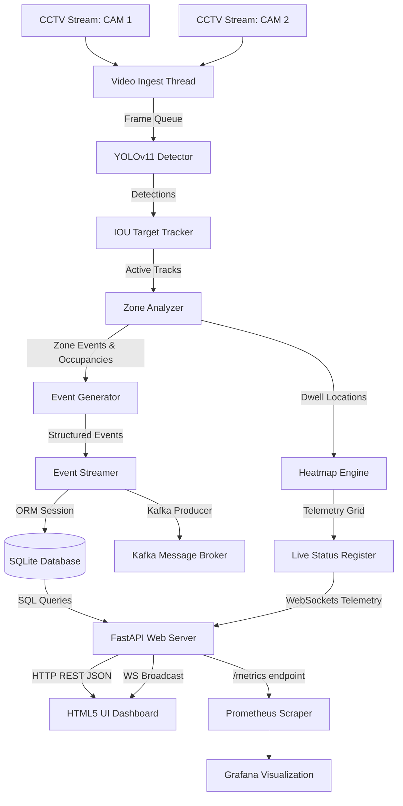

# Purplle AI Store Intelligence System - Architecture Design

This document details the system design, pipeline topology, and architecture components of the **Purplle AI Store Intelligence System** (Purplle AI Sight).

---

## 1. System Architecture Overview

The system is designed to run locally on edge nodes or store servers. It ingests video feeds from CCTV cameras, performs deep learning-based human detection, tracks shoppers, analyzes zone behaviors, and publishes insights to a real-time web dashboard.

---

## 2. Pipeline Components

### 2.1. Video Ingestion (`VideoIngester`)
* Managed in an independent OS daemon thread.
* Connects to cameras via OpenCV `VideoCapture`. Falls back to an optimized simulated mock frame generator if streams are unavailable.
* Maintains a thread-safe frame buffer queue (bounded size of 100 frames) to decouple video capture from the CPU-bound inference thread.

### 2.2. Human Detection (`CustomerDetector`)
* Uses **YOLOv11n** (nano version) to achieve high frame rates on standard CPU environments.
* Configured with a confidence threshold of `0.4` and filters exclusively for COCO class `0` (Person).

### 2.3. Spatial Multi-Object Tracking (`CustomerTracker`)
* Uses an intersection-over-union (IOU) tracking association algorithm to group frame-by-frame bounding boxes into unique, persistent visitor session IDs.
* Features automatic track age expiration management (lost tracks are held for up to 30 frames before memory cleanup to handle short-term occlusions).

### 2.4. Zone Polygon Analysis (`ZoneAnalyzer`)
* Maps normalized polygon coordinates (0.0 to 1.0) into absolute pixels based on the frame dimensions.
* Utilizes ray-casting algorithms (`cv2.pointPolygonTest`) to detect zone entry, exit, and dwell events for coordinates representing visitor centroids.

### 2.5. Event Generation (`EventGenerator`)
* Evaluates retail business rules to emit structured event JSON logs:
  * `customer_entered` / `customer_exited`
  * `shelf_visit` (shopper remains inside a merchandise zone for > 5 seconds)
  * `long_dwell_time` (shopper remains inside a merchandise zone for > 20 seconds)
  * `queue_detected` (high shopper density inside the cashier queue zone)

### 2.6. Event Streaming & Persistence (`EventStreamer`)
* Routes events to Apache Kafka topics: `customer_events`, `zone_events`, `anomaly_events`, and `system_events`.
* Provides an automatic database sink fallback (`_write_to_fallback_database`) to write events directly to the local relational database, ensuring that API analytics remain completely accurate.

---

## 3. API & Web Server Layout

The API server is built using **FastAPI** and runs on **Uvicorn**:
* **`/store/live-status`**: Exposes the live visual tracking register of active shopper bounding boxes, centroids, occlusion status, and spatial heatmaps.
* **`/metrics/footfall`**: Returns hourly visitor traffic trends.
* **`/metrics/zones`**: Returns popularity distribution and average dwell times for cosmetics, skincare, and billing zones.
* **`/metrics/queues`**: Exposes checkout lane average queue length and max wait durations.
* **`/funnel`**: Computes the store drop-off conversion funnel stages (Total Entrants -> Aisle Browsers -> Engaged Shoppers -> Checkout).
* **`/metrics`**: Serves formatted metrics to Prometheus.
* **`/ws/telemetry`**: A 5Hz high-frequency WebSocket channel broadcasting tracking telemetry to dashboard clients.

---

## 4. Observability & Database

* **Database Schema**: Structured using SQLAlchemy ORM:
  * `Camera`: Tracks status and stream configurations.
  * `Zone`: Binds polygons to specific cameras.
  * `TrackedPerson`: Records shopper session entry, exit, and dwell durations.
  * `Event`: Relational log of all events.
  * `Anomaly`: Relational log of alarms.
* **Prometheus Integration**: Exposes metrics under `/metrics` format tracking live shoppers, daily footfall, average dwell time, active anomalies, and conversion rate.
