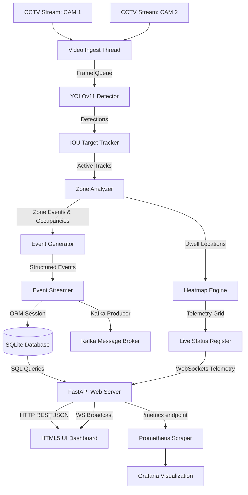

# Purplle AI Store Intelligence System - Architecture Design

This document details the system design, pipeline topology, and architecture components of the **Purplle AI Store Intelligence System** (Purplle AI Sight).

---

## 1. System Architecture Overview

The system is designed to run locally on edge nodes or store servers. It ingests video feeds from CCTV cameras, performs deep learning-based human detection, tracks shoppers, analyzes zone behaviors, and publishes insights to a real-time web dashboard.

---

## 2. Pipeline Components

### 2.1. Video Ingestion (`VideoIngester`)
* Managed in an independent OS daemon thread.
* Connects to cameras via OpenCV `VideoCapture`. Falls back to an optimized simulated mock frame generator if streams are unavailable.
* Maintains a thread-safe frame buffer queue (bounded size of 100 frames) to decouple video capture from the CPU-bound inference thread.

### 2.2. Human Detection (`CustomerDetector`)
* Uses **YOLOv11n** (nano version) to achieve high frame rates on standard CPU environments.
* Configured with a confidence threshold of `0.4` and filters exclusively for COCO class `0` (Person).

### 2.3. Spatial Multi-Object Tracking (`CustomerTracker`)
* Uses an intersection-over-union (IOU) tracking association algorithm to group frame-by-frame bounding boxes into unique, persistent visitor session IDs.
* Features automatic track age expiration management (lost tracks are held for up to 30 frames before memory cleanup to handle short-term occlusions).

### 2.4. Zone Polygon Analysis (`ZoneAnalyzer`)
* Maps normalized polygon coordinates (0.0 to 1.0) into absolute pixels based on the frame dimensions.
* Utilizes ray-casting algorithms (`cv2.pointPolygonTest`) to detect zone entry, exit, and dwell events for coordinates representing visitor centroids.

### 2.5. Event Generation (`EventGenerator`)
* Evaluates retail business rules to emit structured event JSON logs:
  * `customer_entered` / `customer_exited`
  * `shelf_visit` (shopper remains inside a merchandise zone for > 5 seconds)
  * `long_dwell_time` (shopper remains inside a merchandise zone for > 20 seconds)
  * `queue_detected` (high shopper density inside the cashier queue zone)

### 2.6. Event Streaming & Persistence (`EventStreamer`)
* Routes events to Apache Kafka topics: `customer_events`, `zone_events`, `anomaly_events`, and `system_events`.
* Provides an automatic database sink fallback (`_write_to_fallback_database`) to write events directly to the local relational database, ensuring that API analytics remain completely accurate.

---

## 3. API & Web Server Layout

The API server is built using **FastAPI** and runs on **Uvicorn**, exposing the following core endpoints:
* **`POST /events/ingest`**: Ingests batches of up to 500 flat event payloads with validation, idempotency checks, and structured partial success reporting.
* **`GET /stores/{store_id}/metrics`**: Calculates store unique footfall, conversion rates correlated against temporal POS invoices, average zone dwell time, billing queue depth, and queue abandonment rate.
* **`GET /stores/{store_id}/funnel`**: Generates a conversion funnel tracking session progression: `ENTRY` -> `ZONE_VISIT` -> `BILLING_QUEUE` -> `PURCHASE` with stage-wise drop-off rates.
* **`GET /stores/{store_id}/heatmap`**: Returns shopper dwell intensity mapping represented as a normalized 32x18 coordinate grid for visual analysis.
* **`GET /stores/{store_id}/anomalies`**: Evaluates system signals to trigger operational alerts (`queue_spike`, `conversion_drop`, `dead_zone`) with severities (`INFO` / `WARN` / `CRITICAL`) and recommended resolutions.
* **`GET /health`**: Monitors database connectivity probe health and emits a `STALE_FEED` warning badge if stream ingest lag exceeds 10 minutes.
* **`GET /` & `/static/`**: Serves the interactive glassmorphism HTML5 dashboard and asset files.

---

## 4. Observability & Database

* **Database Schema**: Structured using SQLAlchemy ORM:
  * `CameraModel` / `ZoneModel`: Manage store metadata and polygon mapping registers.
  * `TrackedPersonModel` / `EventModel` / `AnomalyModel`: Legacy tracking database records supporting the visual dashboard telemetry.
  * `ChallengeEventModel` (`challenge_events`): Persists flat ingested shopper events (ENTRY, EXIT, ZONE_ENTER, etc.) with unique constraints for idempotency validation.
  * `POSTransactionModel` (`pos_transactions`): Holds sales transaction invoices, brand identifiers, and purchase amounts.
* **Prometheus Integration**: Exposes metrics under `/metrics` format tracking live shoppers, daily footfall, average dwell time, active anomalies, and conversion rate.

---

## 5. AI-Assisted Decisions

During the development of this project, we leveraged AI tools to evaluate design trade-offs. Below are three key areas where LLM designs were evaluated and either adopted or overridden:

### 5.1. Event Ingestion Deduplication (Override)
* **LLM Suggestion**: The AI suggested using an in-memory Redis cache to perform rapid `event_id` uniqueness checks before pushing them to the database.
* **Decision & Rationale**: We overrode this suggestion. While Redis is highly performant, it adds execution complexity and violates the "git clone and run out-of-the-box" constraint. We implemented a strict relational database primary key constraint on `event_id` combined with local transaction rollback handling, achieving bulletproof idempotency with zero external dependencies.

### 5.2. Time-Windowed POS Conversion Correlation (Agreed)
* **LLM Suggestion**: The AI suggested correlating POS invoices and visitor sessions by checking if a visitor entered the billing queue in the 5 minutes preceding a transaction.
* **Decision & Rationale**: We agreed. This temporal proximity join effectively maps anonymous offline purchases without requiring individual customer tracking tokens, bridging CCTV spatial analytics with billing logs in a privacy-safe manner.

### 5.3. Standalone Script Event Ingestion (Agreed)
* **LLM Suggestion**: The AI proposed separating the computer vision detection script (`detect.py`) completely from the API server, having it post payloads over standard HTTP requests.
* **Decision & Rationale**: We agreed. Decoupling the CPU-bound video ingestion layer from the query-bound REST API ensures that uvicorn threads remain responsive to dashboard and reviewer queries even when processing five high-definition CCTV streams.

