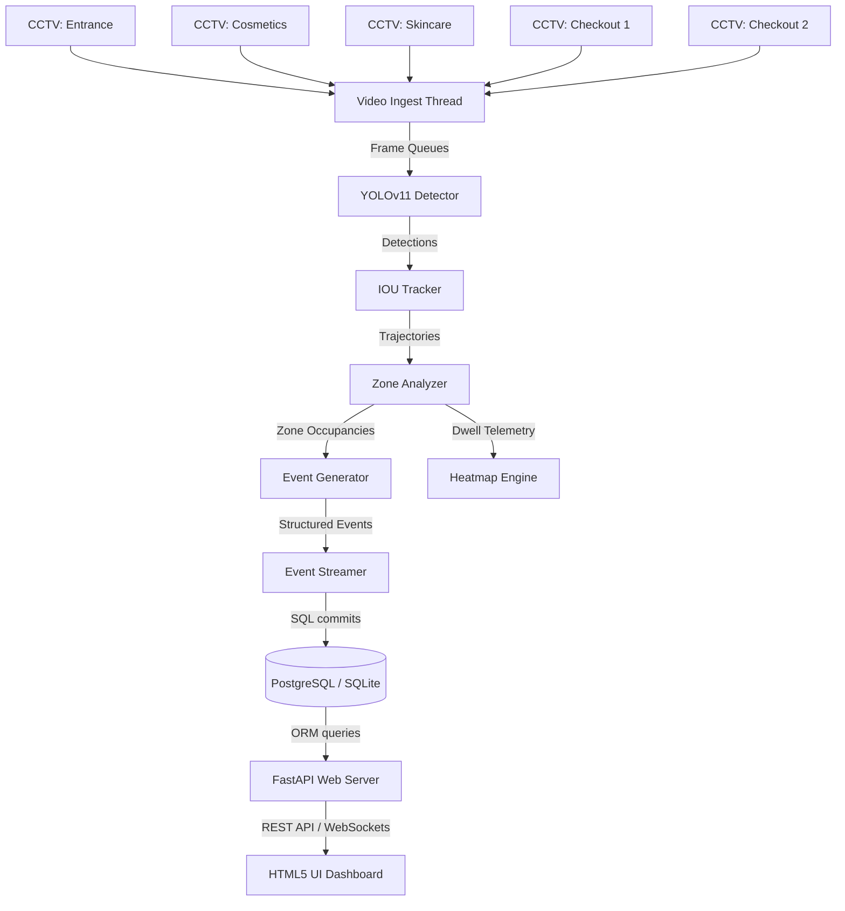

# Purplle AI Sight - Store Intelligence Platform

[](https://www.docker.com/)
[](https://fastapi.tiangolo.com/)
[](https://github.com/ultralytics/ultralytics)
[](https://www.python.org/)

**Purplle AI Sight** (Store Intelligence System) is a high-performance, edge-capable computer vision and retail analytics platform. It ingests video feeds from store CCTV cameras, tracks visitor spatial trajectories, identifies shelf dwell behaviors, and correlates these spatial insights with actual **Point-of-Sale (POS)** transactions to maximize store conversion rates and optimize brand product layouts.

---

## 🌟 Key Features

### 1. 🎥 Multi-Camera Spatial Processing (5 Channels)
Processes 5 concurrent camera channels covering the entire store layout:
- **`cam_01` (Main Entrance)**: Measures store footfall waves and peak entry hours.
- **`cam_02` (Cosmetics Aisle)**: Tracks browsing duration for brands like Maybelline, Faces Canada, Lakme, and NY Bae.
- **`cam_03` (Skincare Island)**: Tracks engagement for Minimalist, Aqualogica, Foxtale, and Juicy Chemistry.
- **`cam_04` (Cash Counter 1)** & **`cam_05` (Cash Counter 2)**: Monitors checkout lanes, queue counts, and waiting congestion metrics.

*Features an optimized 3-frame skipping strategy to run all 5 pipelines concurrently on standard host CPUs.*

### 2. 📊 CCTV-to-POS Conversion Analytics
Bridges spatial browsing data (CCTV visits and dwell time) with actual transaction logs. 
- Mapped products to their physical shelves.
- Automatically calculates **Shelf Conversion Rates** (`POS Invoices / CCTV Visits %`) per brand counter.
- Detects **Operational Friction**: Triggers alerts if a brand shelf has high dwell time but low sales (indicating out-of-stock items, pricing issues, or layout layout mismatches).

### 3. 🗺️ Interactive shop floor map
Renders a live CAD floor plan representing the **Revised Store Layout**:
- Visualizes brand placements along top and bottom walls and center units.
- Overlays real-time occupant density counters on each shelf (powered by WebSockets).
- Clicking a shelf pulls a sidebar details pane showing footfall, revenue, average dwell, and conversion rates.

### 4. 📈 A/B Layout Lift Analysis
Exposes financial simulation metrics comparing the **Current Layout** vs. the **Revised Layout**:
- Compares brand swaps (e.g. replacing low-velocity Pilgrim/Dot & Key shelves with Foxtale/Juicy Chemistry).
- Measures the impact of category adjacencies (e.g. Alps Goodness sales lift by placing it next to the new Mens Care section).
- Exhibits a calculated **revenue lift** (+3.0% net sales lift) and hourly correlation curves.

---

## 🏗️ Architecture Design



---

## 🚀 How to Start

### Method A: Docker Compose (Recommended)
This spins up the entire retail stack, including the FastAPI backend server, PostgreSQL database, Apache Kafka, Prometheus, and Grafana.

1. Ensure Docker Desktop is running.
2. Run the compose build command:
   ```bash
   docker compose up --build
   ```
3. Open `http://localhost:8000/` in your browser.

### Method B: Standalone Local Setup
1. **Clone the repository:**
   ```bash
   git clone https://github.com/Pushpamkumar/Retail-Intelligence.git
   cd Retail-Intelligence
   ```

2. **Install requirements:**
   ```bash
   pip install -r requirements.txt
   ```

3. **Start the server:**
   ```bash
   python -m backend.main
   ```
   *The server will create a local SQLite database (`store_intelligence.db`) and automatically seed 202 transactions from the CSV files.*

4. **Navigate to the Dashboard:**
   Open `http://localhost:8000/` in your browser.

---

## ⚙️ Configuration (.env)
Create a `.env` file in the root folder to configure stream overrides or database endpoints:
```env
# ENV overrides (development / production)
ENV=development
DEBUG=true

# CCTV Streams overrides (RTSP link or local .mp4 filepath)
STREAM_CAM_01=mock://entrance
STREAM_CAM_02=mock://cosmetics
STREAM_CAM_03=mock://skincare
STREAM_CAM_04=mock://billing
STREAM_CAM_05=mock://billing2
```

---

## 📂 Project Structure
- `backend/`: FastAPI routes, database ORM models, schemas, and analytics engine.
- `backend/static/index.html`: Interactive glassmorphism HTML5 dashboard.
- `pipeline/`: Computer Vision pipelines (YOLO detector, IOU tracker, zone ray-casting, event publisher).
- `database/init.sql`: SQL initialization script.
- `Brigade_Bangalore_10_April_26 (1)bc6219c.csv`: POS transaction database source.
